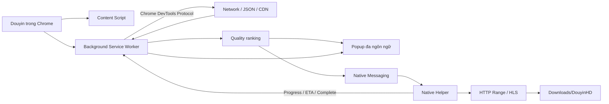

# Douyin HD Pro

<p align="center">
  <strong>Trình tải video Douyin chất lượng cao dành cho Chrome trên Windows.</strong><br>
  Tự bắt luồng media, so sánh chất lượng, tải tốc độ cao và theo dõi tiến trình ngay trong giao diện.
</p>

<p align="center">
  
  
  
  
  
</p>

> **Douyin HD Pro** hoạt động theo hướng local-first. Extension quan sát request media trong chính tab Douyin, còn Native Helper tải file trực tiếp về máy. Dự án không vận hành máy chủ trung gian để nhận hoặc lưu video của người dùng.

## Có gì mới ở v1.1.0

- **Onboarding mới hoàn toàn**: là một màn hình riêng trong popup, không còn overlay/modal dễ bị cắt ở lần mở đầu tiên.
- Font giao diện ưu tiên **Segoe UI Variable / Segoe UI / system-ui / Noto Sans**, hiển thị dấu tiếng Việt rõ và đồng nhất trên Windows.
- **Chọn thư mục lưu tùy ý** ngay khi thiết lập; ở giao diện chính luôn hiển thị đường dẫn hiện tại và nút **Thay đổi**.
- **Mỗi video = một phiên stream riêng**. Khi chuyển video, tool không giữ danh sách luồng cũ.
- Chế độ **Tự động — Khuyên dùng**: phát hiện video mới → reset luồng cũ → tự bắt luồng mới.
- Chế độ **Thủ công**: phát hiện video mới → reset luồng cũ → dừng capture → yêu cầu bấm **Bắt luồng**.
- Sau khi tải xong, phiên hiện tại chuyển sang trạng thái **Đã xong video hiện tại** và hướng dẫn rõ hành vi khi đổi video.
- Có nút **Đặt lại** để xóa phiên hiện tại và bắt lại từ đầu.
- Sửa giao thức Native Helper: **Mở video / Mở thư mục / Chọn thư mục** đều chờ phản hồi thật bằng `requestId`.
- Native Helper ghi nhớ thư mục đã chọn trên máy và whitelist các thư mục đã dùng để mở file an toàn.
- Giữ đủ 10 ngôn ngữ và các thiết lập hành vi bằng Chrome Storage.

## Ngôn ngữ hỗ trợ

Mặc định là **Tiếng Việt**. Người dùng có thể chuyển ngay trong popup giữa:

`Tiếng Việt · English · 简体中文 · 繁體中文 · 한국어 · 日本語 · ไทย · Bahasa Indonesia · Español · Français`

## Tính năng chính

### Bắt và xếp hạng luồng media

Extension dùng Chrome DevTools Protocol thông qua quyền `debugger` để quan sát các request mạng của tab Douyin. Tool kết hợp nhiều tín hiệu để chấm điểm ứng viên:

- MIME type và loại stream MP4/HLS.
- Độ phân giải khi có metadata.
- Bitrate khi có metadata.
- Dung lượng response.
- URL CDN và các dấu hiệu `origin`, `1080`, `uhd`, `4k`, `high`.
- Dữ liệu media tìm được trong JSON/API/hydration của trang.

Mục tiêu là ưu tiên **phiên bản tốt nhất mà Douyin thực sự cung cấp cho phiên xem hiện tại**. Tool không upscale video nguồn.

### Native Helper tốc độ cao

Native Helper viết bằng Python và đóng gói thành EXE bằng PyInstaller. Khi CDN hỗ trợ HTTP Range, helper có thể chia file thành nhiều vùng và tải song song. Nếu CDN không ổn định với Range, tool tự quay về tải tuần tự.

HLS `.m3u8` được hỗ trợ theo hướng tải segment song song. Nếu stream MPEG-TS và máy có FFmpeg, helper có thể remux sang MP4 mà không encode lại.

### UX tải xuống v1.1.0

Popup hiển thị trực tiếp:

- Trạng thái Native Helper.
- Số luồng đã phát hiện.
- Bản được đánh dấu **TỐT NHẤT**.
- Resolution, bitrate, dung lượng và điểm xếp hạng khi có dữ liệu.
- Tiến trình %.
- Dung lượng đã tải / tổng dung lượng.
- Tốc độ tải.
- ETA.
- Đường dẫn file sau khi hoàn tất.
- Nút mở file và thư mục ngay từ popup.
- Màn hình hỏi hành động sau tải và cài đặt có thể mở lại bằng nút ⚙.
- Mọi nút đều hiển thị trạng thái thành công/thất bại.

## Cài nhanh trên Windows

Tải file `Douyin-HD-Pro-v1.1.0-Windows-Full.zip` trong **Releases**, sau đó:

1. Giải nén toàn bộ ZIP.
2. Chạy `CAI-DAT-WINDOWS.bat` — **không cần Run as administrator**.
3. Chrome sẽ mở `chrome://extensions`.
4. Bật **Chế độ dành cho nhà phát triển**.
5. Chọn **Tải tiện ích đã giải nén**.
6. Chọn thư mục `extension` nằm trong gói vừa giải nén.
7. Mở Douyin, phát video khoảng 2–3 giây rồi bấm **↓ Tải HD** hoặc mở popup để chọn stream.

Video mặc định được lưu vào:

```text
%USERPROFILE%\Downloads\DouyinHD
```

Bạn có thể đổi sang thư mục khác ngay trong màn hình thiết lập hoặc bấm **Thay đổi** cạnh mục **Lưu vào** ở giao diện chính. Thư mục tùy chỉnh cần Native Helper; chế độ Chrome fallback vẫn bị giới hạn bởi cơ chế Downloads của Chrome.

## Các gói phát hành

| File | Dành cho |
|---|---|
| `Douyin-HD-Pro-v1.1.0-Windows-Full.zip` | Người dùng Windows, có sẵn Native Helper EXE |
| `Douyin-HD-Pro-v1.1.0-Extension-Only.zip` | Chỉ cần Chrome Extension / Chrome fallback |
| `Douyin-HD-Pro-v1.1.0-Source.zip` | Developer hoặc người muốn audit/build từ source |
| `douyin_hd_native.exe` | Native Helper độc lập |
| `SHA256SUMS.txt` | Kiểm tra tính toàn vẹn artifact |

## Kiến trúc



Xem thêm: [`docs/ARCHITECTURE.md`](docs/ARCHITECTURE.md).

## Quyền Chrome

Douyin HD Pro yêu cầu một số quyền mạnh vì chức năng của nó phụ thuộc trực tiếp vào luồng media đang phát:

- `debugger`: truy cập Chrome DevTools Protocol để đọc metadata request/response của tab Douyin khi người dùng bắt luồng.
- `nativeMessaging`: giao tiếp với Native Helper chạy cục bộ.
- `downloads`: dùng cho chế độ Chrome fallback và mở vị trí file fallback.
- `scripting`, `activeTab`, `tabs`: đọc metadata trang và quản lý đúng tab Douyin.
- `storage`: lưu lựa chọn ngôn ngữ, chế độ phiên video và thiết lập người dùng.
- `clipboardWrite`: sao chép đường dẫn file sau khi tải.

Tool không được thiết kế để vượt DRM, cơ chế mã hóa hoặc quyền truy cập riêng tư.

## Quyền riêng tư

- Không có server backend của dự án.
- Không gửi URL media, cookie hoặc token tới server của dự án.
- Native Helper chỉ nhận thông tin cần thiết từ Extension thông qua Native Messaging.
- File được ghi trực tiếp vào máy người dùng.
- Lựa chọn ngôn ngữ được lưu bằng Chrome Storage.

Chi tiết: [`PRIVACY.md`](PRIVACY.md).

## SmartScreen

Binary trên GitHub Release được build tự động từ source bằng GitHub Actions nhưng hiện chưa có chứng thư Code Signing thương mại. Windows SmartScreen có thể hiển thị cảnh báo reputation cho EXE mới/chưa phổ biến.

Nếu muốn tự audit và build Native Helper trên máy, chạy:

```text
native\install_windows.bat
```

## Developer

Kiểm tra source trước khi commit:

```bash
python -m py_compile native/host.py native/host_core.py
node --check extension/background.js
node --check extension/background/core.js
node --check extension/background/capture.js
node --check extension/background/download.js
node --check extension/i18n.js
node --check extension/i18n-v104.js
node --check extension/i18n-v110.js
node --check extension/content.js
node --check extension/popup.js
```

GitHub Actions tự kiểm tra manifest, phiên bản và đủ 10 locale.

## Giới hạn

Douyin có thể thay đổi cấu trúc frontend, CDN hoặc định dạng API bất kỳ lúc nào. Không có công cụ phía client nào đảm bảo lấy được mọi phiên bản chất lượng của mọi video. Với nội dung được mã hóa/DRM, Douyin HD Pro sẽ dừng thay vì cố vượt bảo vệ.

## Giấy phép

MIT License. Xem [`LICENSE`](LICENSE).
