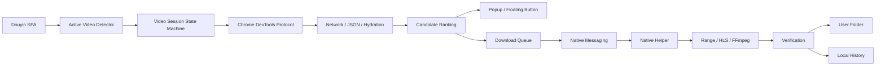

# Douyin HD Pro

<p align="center">
  <strong>Trình tải video Douyin chất lượng cao, local-first, dành cho Chrome trên Windows.</strong><br>
  Nhận diện đúng video đang xem, tách phiên theo từng video, chọn chất lượng, tải song song, xác minh file và quản lý lịch sử ngay trong popup.
</p>

<p align="center">
  
  
  
  
  
</p>

> Douyin HD Pro hoạt động theo hướng **local-first**. Dự án không có backend trung gian để nhận hoặc lưu video, URL media, cookie hay lịch sử tải của người dùng.

## v2.0.0 — bản tích hợp hoàn chỉnh

v2.0.0 gom toàn bộ các cải tiến UX và cơ chế vận hành thành một kiến trúc thống nhất:

- **Nhận diện video đang active** bằng viewport, trạng thái phát, URL/video ID và media signature — phù hợp với Douyin dạng SPA/scroll feed.
- **1 video = 1 phiên riêng**. Khi chuyển video, stream cũ bị loại bỏ; không dùng nhầm candidate của video trước.
- State machine rõ ràng: `Đang chờ → Đang phân tích → Sẵn sàng → Đang tải → Đã xong / Có lỗi`.
- Card **Video hiện tại** hiển thị thumbnail, tiêu đề, tác giả, video ID và trạng thái.
- **Chống tải trùng** bằng lịch sử local: hỏi người dùng, tự tải lại hoặc tự bỏ qua.
- **Hàng đợi tải thật**: Native Helper chạy tối đa 2 download song song; tác vụ dư chờ theo thứ tự và vẫn tiếp tục khi người dùng chuyển video.
- Chọn chất lượng mặc định: **cao nhất / 1080p / 720p / nhẹ nhất / hỏi mỗi lần**.
- Danh sách quality chỉ hiển thị thông tin dễ hiểu: resolution, bitrate, dung lượng, loại MP4/HLS — không đưa điểm nội bộ ra UI.
- **Thư mục lưu tùy chỉnh** luôn có nút thay đổi ở onboarding, màn hình chính và Settings.
- **Mẫu tên file** và **mẫu thư mục con** với `{author}`, `{title}`, `{date}`, `{time}`, `{video_id}`.
- **Xác minh file sau tải**: dùng FFprobe khi có; nếu không có thì kiểm tra cấu trúc cơ bản.
- Native Helper chỉ ghép audio/video bằng FFmpeg khi có stream audio tách riêng được xác định rõ; không tự ghép nguồn âm thanh mơ hồ để tránh sai nội dung.
- **Diagnostics** kiểm tra Native Helper/version, quyền ghi folder, FFmpeg, FFprobe, Douyin, stream và hàng đợi; có nút sao chép báo cáo.
- **Update checker** chỉ chạy khi người dùng chủ động bấm kiểm tra.
- **Export / Import Settings** bằng JSON.
- Tùy chỉnh nút nổi: luôn hiện / chỉ rõ khi hover / ẩn; trái/phải; trên/giữa/dưới.
- **Privacy mode**: có thể tắt hoàn toàn lịch sử tải.
- Onboarding có preset: **Cá nhân / Làm nội dung / Nghiên cứu / Nâng cao**.
- Font hệ thống ưu tiên **Segoe UI Variable Text / Segoe UI / Noto Sans** để tiếng Việt rõ và đẹp trên Windows.
- 10 ngôn ngữ: `Tiếng Việt · English · 简体中文 · 繁體中文 · 한국어 · 日本語 · ไทย · Bahasa Indonesia · Español · Français`.

## Cài nhanh trên Windows

Tải file **`Douyin-HD-Pro-v2.0.0-Windows-Full.zip`** trong Releases, sau đó:

1. Giải nén toàn bộ ZIP.
2. Chạy `CAI-DAT-WINDOWS.bat` — **không cần Run as administrator**.
3. Chrome mở `chrome://extensions`.
4. Bật **Chế độ dành cho nhà phát triển**.
5. Chọn **Tải tiện ích đã giải nén**.
6. Chọn thư mục `extension` trong gói vừa giải nén.
7. Mở Douyin và sử dụng nút nổi hoặc popup.

Thư mục mặc định:

```text
%USERPROFILE%\Downloads\DouyinHD
```

Bạn có thể đổi sang ổ/thư mục khác ngay trong tool.

## Quy trình sử dụng

### Chế độ tự động — khuyên dùng

```text
Video A
  ↓
Bắt luồng → chọn quality → tải
  ↓
Video A hoàn tất
  ↓
Chuyển sang Video B
  ↓
Reset stream A
  ↓
Tạo phiên B mới
  ↓
Nếu capture đang chạy → tự phân tích B
```

### Chế độ thủ công

```text
Video A hoàn tất
  ↓
Chuyển sang Video B
  ↓
Reset stream A + dừng capture
  ↓
Chờ người dùng bấm "Bắt luồng"
```

Request mạng của phiên cũ còn trả về muộn cũng bị loại bằng **session epoch**, giảm nguy cơ stream A quay lại sau khi đã sang B.

## Chất lượng tải

Tool chỉ chọn trong các phiên bản mà Douyin thực sự cung cấp cho phiên xem hiện tại; không upscale video.

Các chế độ:

- **Cao nhất có thể**: xếp hạng theo resolution, bitrate, dung lượng, MIME và tín hiệu source/original.
- **Ưu tiên 1080p**: chọn candidate có cạnh ngắn gần 1080 nhất.
- **Ưu tiên 720p**: chọn candidate có cạnh ngắn gần 720 nhất.
- **Nhẹ nhất**: ưu tiên file có dung lượng nhỏ nhất khi metadata có sẵn.
- **Hỏi mỗi lần**: người dùng chọn trực tiếp candidate trong popup.

## Native Helper

Native Helper viết bằng Python và được build thành EXE bằng PyInstaller.

Extension v2 chỉ dùng Native Helper cùng major version 2.x. Nếu phát hiện Helper cũ, UI cảnh báo và download có thể fallback qua Chrome cho đến khi chạy lại `CAI-DAT-WINDOWS.bat`.

### Direct MP4

Nếu CDN hỗ trợ `HTTP Range`, helper chia file thành nhiều range và tải song song. Nếu Range không ổn định, nó tự fallback về tải tuần tự.

### HLS

HLS `.m3u8` được hỗ trợ theo hướng tải segment song song. Tool không vượt encryption/DRM. Với MPEG-TS và máy có FFmpeg, helper có thể remux sang MP4 mà không encode lại.

### Xác minh file

Sau khi tải xong:

- kiểm tra file tồn tại và dung lượng hợp lý;
- kiểm tra container cơ bản;
- nếu có `ffprobe`, đọc video/audio stream, codec, duration và resolution;
- kết quả được trả về popup dưới dạng **File đã được xác minh** hoặc cảnh báo rõ ràng.

## Hàng đợi & lịch sử

Tab **Hoạt động** gồm:

- download đang chạy và tác vụ đang chờ;
- tối đa 2 Native download chạy đồng thời;
- % tiến trình và tốc độ;
- tối đa lịch sử theo cài đặt (20–500 mục);
- mở video / mở thư mục;
- xóa từng mục hoặc toàn bộ lịch sử.

Lịch sử được lưu bằng `chrome.storage.local` và **không gửi ra server**.

## Chống tải trùng

Khi cùng `video_id` hoặc video key đã có trong lịch sử, tool có thể:

- hỏi người dùng;
- luôn tải lại;
- tự bỏ qua.

Nếu chọn **Hỏi tôi**, popup cho phép **Mở file cũ** hoặc **Tải lại**.

## Mẫu tên & thư mục

Ví dụ tên file:

```text
{author} - {title}
{date} - {video_id} - {title}
```

Ví dụ thư mục con:

```text
{author}/{date}
```

Native Helper luôn sanitize segment và giữ folder con nằm bên trong thư mục gốc đã được người dùng cho phép.

## Diagnostics

**Cài đặt → Kiểm tra hệ thống** hiển thị:

- Native Helper và version;
- thư mục lưu + quyền ghi;
- FFmpeg;
- FFprobe;
- trạng thái tab Douyin;
- số stream của video hiện tại;
- số slot tải song song / số tác vụ đang chờ.

Có thể bấm **Sao chép báo cáo chẩn đoán** để gửi kèm khi báo lỗi.

## Quyền Chrome

- `debugger`: dùng Chrome DevTools Protocol để quan sát request media của tab Douyin khi capture.
- `nativeMessaging`: giao tiếp với Native Helper cục bộ.
- `downloads`: Chrome fallback và thao tác file fallback.
- `scripting`, `activeTab`, `tabs`: đọc metadata video và quản lý đúng tab.
- `storage`: cài đặt, lịch sử local và ngôn ngữ.
- `clipboardWrite`: sao chép đường dẫn file.
- `https://api.github.com/*`: **chỉ dùng khi người dùng chủ động bấm “Kiểm tra cập nhật”**.

## Quyền riêng tư

- Không có server backend của dự án.
- Không bán hoặc gửi dữ liệu người dùng cho bên thứ ba.
- Không tự động gọi GitHub API ở nền; update check là thao tác chủ động.
- Có thể tắt hoàn toàn lịch sử tải.
- Tool không được thiết kế để vượt DRM, encryption hay nội dung riêng tư.

Chi tiết: [`PRIVACY.md`](PRIVACY.md).

## Các gói phát hành

| File | Dành cho |
|---|---|
| `Douyin-HD-Pro-v2.0.0-Windows-Full.zip` | Bản khuyên dùng cho Windows, có Native Helper EXE |
| `Douyin-HD-Pro-v2.0.0-Extension-Only.zip` | Chỉ Chrome Extension / Chrome fallback |
| `Douyin-HD-Pro-v2.0.0-Source.zip` | Developer, audit hoặc tự build |
| `douyin_hd_native.exe` | Native Helper độc lập |
| `SHA256SUMS.txt` | Checksum SHA-256 của artifacts |

## Kiến trúc



Xem thêm [`docs/ARCHITECTURE.md`](docs/ARCHITECTURE.md).

## Developer

```bash
python -m py_compile native/host.py native/host_core.py
python -m unittest tests.test_native -v
node tests/test_background.js
node tests/test_static.js
node --check extension/background.js
node --check extension/background/core.js
node --check extension/background/capture.js
node --check extension/background/library.js
node --check extension/background/download.js
node --check extension/i18n.js
node --check extension/i18n-v200.js
node --check extension/content.js
node --check extension/popup.js
```

GitHub Actions chạy syntax check, Native/background smoke tests, kiểm tra version/manifest và đúng 10 locale trước khi build Release.

## SmartScreen

EXE trên Releases được build từ source bằng GitHub Actions nhưng chưa có chứng thư Code Signing thương mại. Windows SmartScreen có thể cảnh báo reputation với binary mới/chưa phổ biến.

Bạn có thể tự build từ source bằng:

```text
native\install_windows.bat
```

## Giới hạn

Douyin có thể thay đổi frontend, API hoặc CDN bất kỳ lúc nào. Không thể đảm bảo mọi video luôn cung cấp cùng metadata/chất lượng. Nếu stream được mã hóa/DRM, tool dừng thay vì cố vượt bảo vệ.

## License

MIT License — xem [`LICENSE`](LICENSE).
