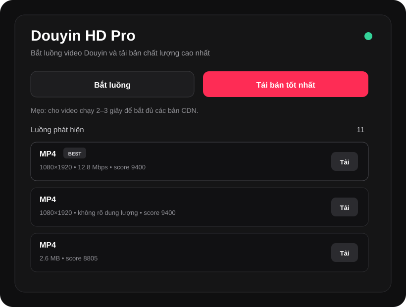
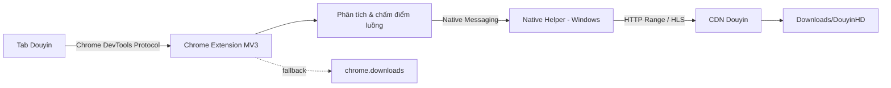

# Douyin HD Pro

<p align="center">
  <strong>Trình tải video Douyin chất lượng cao dành cho Chrome trên Windows.</strong><br>
  Bắt trực tiếp luồng media mà trình duyệt đang phát, tự đánh giá các nguồn và ưu tiên phiên bản tốt nhất.
</p>

<p align="center">
  
  
  
  
</p>

> **Douyin HD Pro** được xây dựng theo hướng local-first: Extension quan sát luồng media ngay trong tab Douyin, còn Native Helper tải file trực tiếp về máy. Tool không dùng máy chủ trung gian của dự án để nhận hoặc lưu video.



## Điểm nổi bật

- **Bắt luồng thật đang phát:** dùng Chrome DevTools Protocol thông qua quyền `chrome.debugger`, thay vì chỉ phụ thuộc vào một API cố định của Douyin.
- **Tự chọn bản tốt nhất:** chấm điểm theo độ phân giải, bitrate, dung lượng, loại media và dấu hiệu chất lượng trong CDN/URL.
- **Tải MP4 tốc độ cao:** hỗ trợ HTTP Range và chia file thành tối đa 16 phần tải song song khi máy chủ cho phép.
- **Hỗ trợ HLS:** đọc master playlist, ưu tiên variant có resolution/bandwidth cao nhất và tải segment song song.
- **Native Messaging:** Extension gửi URL + request headers cần thiết sang Native Helper chạy cục bộ trên Windows.
- **Fallback bằng Chrome:** nếu Native Helper chưa sẵn sàng, Extension vẫn có thể thử tải bằng `chrome.downloads`.
- **Không upscale giả:** tool lấy chất lượng tốt nhất mà Douyin thực sự cấp cho phiên trình duyệt hiện tại.
- **Không vượt DRM:** luồng mã hóa/DRM không được cố gắng giải mã hoặc vượt cơ chế bảo vệ.

## Kiến trúc



## Cài đặt nhanh

### Cách khuyến nghị — Gói Windows Full

1. Tải gói **`Douyin-HD-Pro-v1.0.2-Windows-Full.zip`** trong phần Releases.
2. Giải nén ra một thư mục cố định.
3. Chạy `native/install_prebuilt_windows.bat`.
4. Mở `chrome://extensions` → bật **Chế độ dành cho nhà phát triển**.
5. Chọn **Tải tiện ích đã giải nén / Load unpacked** → chọn thư mục `extension`.
6. Mở lại Douyin và tải video.

### Cách build Native Helper trực tiếp trên máy

Nếu bạn không muốn dùng file `.exe` build sẵn:

1. Clone hoặc tải Source Code.
2. Chạy `native/install_windows.bat`.
3. Script tự tạo môi trường Python tạm, cài PyInstaller, build `native/host.py`, sau đó đăng ký Native Messaging trong `HKCU`.
4. Load thư mục `extension` trong Chrome.

> Cách source-build không cần quyền Administrator. Nếu máy chưa có Python, installer sẽ thử cài Python 3.12 bằng `winget`.

## Sử dụng

### Một nút

1. Mở video trên `douyin.com`.
2. Cho video chạy 2–3 giây để các CDN được gọi.
3. Bấm nút **↓ Tải HD** hoặc mở popup Extension.
4. Chọn **Tải bản tốt nhất**.

### Chọn thủ công

Popup hiển thị các ứng viên đã phát hiện. Dòng **BEST** là ứng viên có điểm chất lượng cao nhất tại thời điểm đó. Bạn cũng có thể bấm **Tải** ở từng dòng để chọn chính xác luồng mong muốn.

File mặc định được lưu tại:

```text
C:\Users\<user>\Downloads\DouyinHD\
```

## Cơ chế chọn chất lượng

Douyin có thể cấp nhiều URL cho cùng một video. Tool kết hợp thông tin từ network response, JSON API, dữ liệu hydration trên trang và thẻ `<video>`. Điểm ưu tiên xem xét:

- độ phân giải (`width × height`);
- bitrate nếu có;
- tổng dung lượng hoặc Content-Range;
- MP4/direct media so với nguồn ít chắc chắn hơn;
- dấu hiệu HD/origin trong URL/CDN;
- dữ liệu `play_addr`, `bit_rate`, `url_list` trong response.

Ví dụ: nếu cùng một video có 720×1280 và 1080×1920, bản 1080×1920 thường được ưu tiên. Nếu Douyin chỉ cấp 720p, tool không tạo 1080p giả.

## Các gói phát hành

| Gói | Dành cho | Nội dung |
|---|---|---|
| `Windows-Full.zip` | Người dùng thông thường | Extension + Native Helper build sẵn + installer |
| `Extension-Only.zip` | Chỉ muốn Extension/fallback | Thư mục Extension có thể Load unpacked |
| `Source.zip` | Developer/audit | Toàn bộ source, docs, workflow và script build |
| `douyin_hd_native.exe` | Developer | Native Helper build độc lập trên Windows |
| `SHA256SUMS.txt` | Kiểm tra toàn vẹn | SHA-256 của các artifact phát hành |

## Quyền Chrome

Extension dùng một số quyền mạnh vì đặc thù kỹ thuật:

- `debugger`: quan sát request/response media thông qua Chrome DevTools Protocol;
- `nativeMessaging`: giao tiếp với Native Helper cục bộ;
- `downloads`: fallback tải bằng Chrome;
- `storage`: lưu trạng thái/cấu hình;
- `tabs`, `activeTab`, `scripting`: làm việc với tab Douyin hiện tại.

Phạm vi host trong Manifest chỉ nhắm tới `douyin.com` và các subdomain của Douyin.

## Quyền riêng tư

- Không có analytics của dự án.
- Không gửi lịch sử duyệt web đến máy chủ của dự án.
- Không tải video qua máy chủ trung gian của dự án.
- URL media và request headers chỉ được chuyển từ Extension sang Native Helper trên chính máy người dùng để thực hiện tải xuống.

Chi tiết: [PRIVACY.md](PRIVACY.md).

## Khắc phục sự cố

### Chrome báo `Could not establish connection. Receiving end does not exist`

Phiên bản 1.0.2 đã xử lý trường hợp background gửi message sang tab không phải Douyin. Hãy đảm bảo bạn đang chạy đúng v1.0.2 trở lên và reload Extension.

### PyInstaller báo đang chạy từ `C:\Windows\System32`

Installer v1.0.2 tự chuyển working directory về thư mục build trước khi gọi PyInstaller. Không cần chạy bằng Administrator.

### Bấm tải nhưng không thấy trong `Ctrl+J`

Native Helper lưu trực tiếp vào `Downloads\DouyinHD`, vì vậy tải Native không nhất thiết xuất hiện trong trang `chrome://downloads`.

### Windows SmartScreen cảnh báo

Artifact build sẵn của dự án chưa có chứng thư Code Signing thương mại nên Windows có thể hiển thị cảnh báo reputation. Bạn có thể dùng phương án **source-build** (`install_windows.bat`) để build Native Helper trực tiếp từ source trên máy của mình.

Xem thêm: [docs/TROUBLESHOOTING.md](docs/TROUBLESHOOTING.md).

## Gỡ cài đặt

1. Chạy `native/uninstall_windows.bat`.
2. Xóa Douyin HD Pro trong `chrome://extensions`.
3. Nếu muốn, xóa thư mục video `Downloads\DouyinHD` thủ công.

## Phát triển

Yêu cầu khuyến nghị:

- Chrome 120+;
- Windows 10/11;
- Python 3.11+ khi build Native Helper từ source;
- PyInstaller;
- FFmpeg tùy chọn cho một số HLS MPEG-TS.

Xem [CONTRIBUTING.md](CONTRIBUTING.md) và [docs/ARCHITECTURE.md](docs/ARCHITECTURE.md).

## Pháp lý & sử dụng có trách nhiệm

Tool chỉ là công cụ kỹ thuật hỗ trợ tải các luồng media mà trình duyệt của người dùng có quyền truy cập. Người dùng chịu trách nhiệm tuân thủ điều khoản của nền tảng, quyền tác giả, quyền riêng tư và pháp luật áp dụng. Chỉ tải, lưu trữ hoặc tái sử dụng nội dung khi bạn có quyền phù hợp.

Douyin HD Pro không liên kết, được tài trợ hoặc xác nhận bởi Douyin/ByteDance.

## Phiên bản

Phiên bản hiện tại: **v1.0.2** — xem [CHANGELOG.md](CHANGELOG.md).

## License

Phát hành theo giấy phép [MIT](LICENSE).

---

Made by **[@binkadev](https://github.com/binkadev)**.
